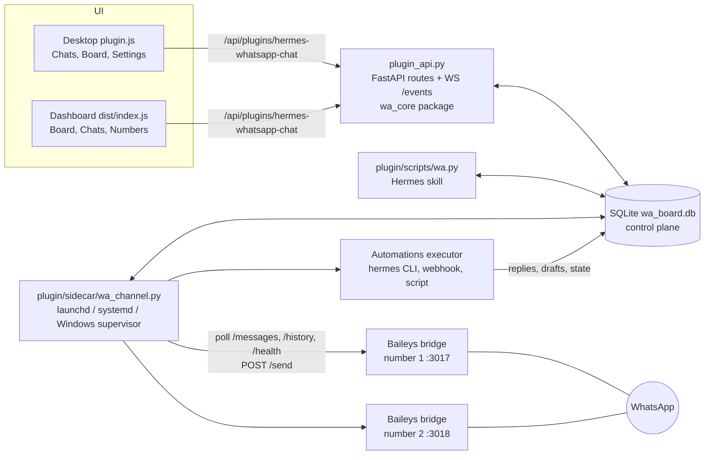

# hermes-whatsapp-chat

A [Hermes](https://hermes-agent.nousresearch.com) plugin that turns WhatsApp into a real chat inbox inside the Hermes desktop app and web dashboard, and lets Hermes agents work the inbox with you.

- **Multi-number chat.** Link several WhatsApp numbers by scanning a QR code from the plugin itself. Each number has its own session, label and color. Conversations are stored per number: the same contact on two numbers is two conversations.
- **Chats + Kanban board.** A full chat UI (thread, media, reply, drafts, search) and a board of conversation states: New, In progress, Waiting, Muted, Closed. WhatsApp groups are conversations too, and every contact or group sits in a list (Admin, Work, Personal, To classify, Ignored).
- **Independent WhatsApp channel.** A small background service (LaunchAgent on macOS, systemd user unit on Linux, sign-in launcher on Windows) runs one vendored [Baileys](https://github.com/WhiskeySockets/Baileys) bridge per number. It has nothing to do with Hermes' native WhatsApp gateway, so you can keep a dedicated number (or several) for this inbox.
- **Automations / dispatcher.** Rules react to inbound or outbound messages and conversation events, and dispatch to a Hermes agent or profile, a webhook, a script, or a built-in action. Agent replies can be saved as drafts for you to approve, sent immediately, or kept only in the run log.
- **CLI + Hermes skill.** `plugin/scripts/wa.py` and the bundled `whatsapp-chat` skill let any Hermes agent list, read, draft, send, tag and re-state conversations. Everything shows up live in the UI.

The desktop app is the full experience. The web dashboard has the board, the chat (thread, reply, drafts) and number status/QR. Settings and automations are desktop only.

## Requirements

- macOS, Linux (systemd) or Windows: the channel service runs as a LaunchAgent, a systemd user unit or a Startup-folder launcher respectively.
- A working Hermes install (desktop app and/or dashboard). Node 22 comes with it (`~/.hermes/node/bin/node`); the service needs Node 20 or newer.
- On Windows, Git (for example `winget install --id Git.Git -e`) if Hermes did not bring its own: Hermes clones every plugin installed from Git, and without it the install fails with `spawn git ENOENT`. Restart Hermes after installing Git.

Nothing else: no Python environment to create, no repository to clone, no terminal commands. The plugin runs on Hermes' own Python and installs its Node dependencies by itself.

## Install

1. In the Hermes desktop app open **Capabilities → Plugins → Install from Git** and enter:

   ```
   singleflo/hermes-whatsapp-chat#plugin
   ```

   Enable both halves (agent and desktop). The `#plugin` suffix makes Hermes install only the `plugin/` folder of the repository.

   Prefer the terminal? One command does the same:

   ```bash
   hermes plugins install singleflo/hermes-whatsapp-chat#plugin --enable
   ```

2. Open **Conversations**: the first time it shows **Restart Hermes to finish installing WhatsApp Chat** (Hermes loads plugin backends only when it starts). Click **Restart Hermes now**; the app closes and opens again with the plugin loaded. Without the desktop app, quit and reopen Hermes (or restart `hermes dashboard`).
3. The WhatsApp channel service installs and starts itself the first time Hermes starts with the plugin (macOS LaunchAgent, Linux systemd user unit, Windows Startup launcher with a keep-alive supervisor); no click is needed. On its first start it downloads the bridge's Node dependencies (progress in `<data>/logs/npm.log`); numbers show "starting" until that finishes. **Settings → Numbers** (or the **Numbers** tab of the dashboard) shows its status and has **Install service** / **Reinstall** / **Uninstall service**; after an explicit uninstall the service is not installed again automatically until you click **Install service**. On Linux the unit needs systemd and, to survive logout, lingering (`loginctl enable-linger <user>`, enabled automatically when permitted).
4. Click **Add number** and scan the QR code: WhatsApp on your phone → Settings → Linked devices → Link a device.
5. Optional: click **Install skill** in the same screen to give Hermes agents the CLI skill (see below).

If something does not start, the service log is `~/.hermes/plugin-data/hermes-whatsapp-chat/logs/channel.log`.

### What lives where

| What | Where |
|---|---|
| Plugin code: backend, sidecar, vendored bridge, CLI, skill template | `~/.hermes/plugins/hermes-whatsapp-chat/` (the cloned `plugin/` folder; replaced on update) |
| Desktop half | `~/.hermes/desktop-plugins/hermes-whatsapp-chat/plugin.js` (copied by Hermes from the plugin folder) |
| Your data: database, WhatsApp sessions, media, uploads, logs, launchers | `~/.hermes/plugin-data/hermes-whatsapp-chat/` (survives update and removal) |
| Service definition | macOS LaunchAgent `~/Library/LaunchAgents/it.fl1.hermes-whatsapp-chat.channel.plist`; Linux systemd user unit `~/.config/systemd/user/hermes-whatsapp-chat-channel.service`; Windows Startup-folder launcher `hermes-whatsapp-chat-channel.vbs` |
| Installed skill | `~/.hermes/skills/whatsapp-chat/SKILL.md` |

On Windows the Hermes home is `%LOCALAPPDATA%\hermes` instead of `~/.hermes` (unless `HERMES_HOME` is set), so every `~/.hermes/...` path above lives there.

The service and the CLI run through a small launcher, `<data>/bin/hwc-python` (`hwc-python.cmd` and `wa.cmd` on Windows), written by the backend. It starts the same Python interpreter and import path as the Hermes dashboard backend, so no separate virtualenv is needed. `<data>/bin/wa` is the CLI wrapper the skill and the automation templates use.

### Update

```bash
hermes plugins update hermes-whatsapp-chat
```

An update re-clones the plugin folder, so downloaded Node dependencies are dropped and fetched again on the next service start. Then restart the Hermes app: on start the backend rewrites the launchers and the service definition and restarts the service by itself (**Reinstall service** in **Settings → Numbers** does the same on demand). If you use the skill, click **Install skill** again to refresh it. Your data is untouched.

### Uninstall

1. In **Settings → Numbers** log the numbers out (unlinks the devices on WhatsApp's side), then click **Uninstall service** (stops the service and removes its definition; the service then stays off on this machine until you click **Install service** again). Click **Remove skill** if you installed it.
2. Remove the plugin: **Capabilities → Plugins** (remove), or `hermes plugins remove hermes-whatsapp-chat`.

Removing the plugin deletes only the plugin folder. Your data stays in `~/.hermes/plugin-data/hermes-whatsapp-chat/` until you delete it yourself.

## Using it

The desktop page has three sections: **Chats**, **Board**, **Settings**.

### Chats

A conversation list (all numbers, filterable by number, state and unread; messages can be searched across all of them) next to the thread. You can reply with text or a file, take over from the agent or hand back, escalate, mute, tag, move to another state and read the audit trail of state changes. Agent drafts appear in the thread with a Draft marker: approve (optionally edit first) or discard. Messages are labeled with who wrote them: contact, you (board), the linked phone, an agent profile, a rule, or the CLI. Live updates arrive over a WebSocket, with a polling fallback.

**New chat** starts a conversation with a number that never wrote to you: enter the number with its country code (`+39 333 1234567`), **Check number** tells you whether it is on WhatsApp (or already in your chats), then **Save draft** or **Send**. Rules: the country code is never guessed, text only (send files afterwards in the conversation), the new conversation starts In progress (Waiting once you send) and never counts as "a contact wrote first" for notifications or `conversation.created` rules, and at most 10 new chats per hour per number are allowed because WhatsApp can block numbers that cold-message people. Hermes can do the same with `wa check`, `wa send-to` and `wa draft-to`.

### Board

Five columns, one card per conversation: New, In progress, Waiting, Muted, Closed (hidden until you ask for it). Cards show the contact, number, preview, age, unread count, tags, urgency and drafts. Drag a card to move it; dropping on Muted snoozes it for the configured number of hours.

### Settings

- **Numbers**: add, rename, recolor, start/stop/restart, log out, remove (with or without deleting its conversations), choose the history import mode (`off`, `recent`, `full`) and an optional Hermes profile per number. Shows the background service status and QR pairing.
- **Conversation rules** (defaults in parentheses):
  - contact writes to a closed conversation: reopen as New, go back to the previous state, or keep closed (reopen as New);
  - contact replies while Waiting: move to In progress or keep (In progress);
  - contact writes to a muted conversation: reopen as New or keep (reopen as New);
  - your reply on a New / In progress conversation: move to Waiting or keep (Waiting);
  - auto-reply window: a message typed on the linked phone within N seconds of an inbound message is treated as a WhatsApp Business away/greeting auto-reply and changes nothing (10 s);
  - auto-close Waiting conversations after N days (7).
- **Notifications**: native notifications for new conversations, every inbound message, escalations; quiet hours.
- **Board**: urgency threshold, mute presets, drop-to-mute duration, closed-column limit.
- **Hours**: timezone and weekly business hours (used by automation conditions).
- **Automations**: the dispatcher described below, with a test button (dry run on a conversation) and a run log with retry.
- **Jev**: opt-in exit conditions scored by TypeSafe Jev (see "Jev exit conditions" below): you write your rules in plain text, **Generate conditions** turns them into conditions and automation rules, and a box tries a message.

Conversations created by history import start Closed, and history messages never trigger rules, unread counters, notifications or automations.

### Groups, lists and silence

- **Groups.** WhatsApp groups appear as conversations (marked "Group"); the group history is imported like any other chat, and your own messages typed on the phone show up too. Each incoming message shows who wrote it, and the group's name and participants are read from WhatsApp in the background. You can reply in a group like in any chat. Automations and Jev do not run on groups yet.
- **Lists.** Every contact and group is in one of five lists: **Admin**, **Work**, **Personal**, **To classify** (where everything new starts) and **Ignored**. The list belongs to the person or group, so it is the same on all your numbers; a single conversation can override it for one number only. In Settings → Numbers, each number chooses which list new contacts and new groups go to. **Ignored** conversations are hidden from the chat list and the board unless you filter for them, and never notify. Lists do not change what Jev or agents do yet.
- **Silence.** Silence a conversation for 8 hours, a day, a week or forever: it stops notifications only, whatever its state or list.
- **Filters.** The chat list and the board filter by list (default: every list except Ignored) and by type (All, Direct, Groups). Over the API: `list=<id>|all` and `type=group|direct` on `GET /conversations` and `GET /board`.

### Automations

An automation rule has an optional number filter, event types, conditions, an action, a reply mode and a "stop after match" flag. Rules run in order.

- **Events**: `message.in`, `message.out`, `conversation.created`, `conversation.state_changed`, `conversation.classified` (Jev result stored).
- **Conditions** (all optional, all must hold): conversation states, agent active or not, inside/outside business hours, text contains any of / matches a regex, any of the tags, first message of the conversation, message direction, Jev exit conditions.
- **Actions**:
  | Type | What it does |
  |---|---|
  | `hermes` | Runs `hermes [-p PROFILE] chat -Q -q <prompt> --source whatsapp-chat [-s skill ...]`. Stdout is the reply. The profile defaults to the number's Hermes profile. |
  | `webhook` | POSTs `{event, conversation, messages}` as JSON, signed with `X-WA-Signature: sha256=<hmac>` when a secret is set. A JSON response may contain `reply`, `state`, `tags`, `escalate`. |
  | `script` | Runs a command with the same JSON on stdin; stdout JSON uses the webhook response shape. |
  | `reply` | Sends/drafts a fixed text template. |
  | `set_state` | Moves the conversation to a state. |
  | `add_tags` | Adds tags. |
  | `escalate` | Raises priority. |
  | `takeover` | Hands the conversation to a human (agent stops answering). |
- **Prompt templates**: `{contact_name} {phone} {text} {account_label} {state} {conversation_id} {history} {wa_cli} {jev}`.
- **Reply mode** (what happens with a reply text): `draft` (default, saved as a draft authored `agent:<profile>` or `rule:<id>` for you to approve), `send` (sent immediately), `none` (kept only in the run output).

Safety nets: runs are skipped when a human took over (`agent_active` off), automations never trigger on messages written by agents or rules (no loops), there is a per-conversation hourly rate limit, and failed runs retry up to 3 attempts with backoff (30 s, then 120 s).

### Jev exit conditions

Optional. You write your rules in plain words, like a `USER.md`: which situations matter and what should happen ("if the client is upset, a person answers; routine questions get a draft from the agent"). **Generate conditions** asks the default model of your Hermes profile (one shot, no tools, JSON only, about 20–60 s) to turn them into **exit conditions** (label, a description Jev reads, a minimum score from 0 to 1) and the actions of each; there is always an implicit **Else** after them. The preview shows every condition, its actions and a few example messages that Jev scores right away (✓ when the example lands on the condition it should); when some miss, the model gets one more try with Jev's scores and the better version is kept. So you can see whether the conditions work before you **Apply** them. [TypeSafe Jev](https://typesafe.ai) then scores every incoming text message against the conditions in one call of about half a second, without running an LLM. The first condition in the list whose score reaches its minimum is chosen; when none does, Else is chosen. The result is stored on the conversation and raises the `conversation.classified` event, and the actions of the chosen condition run as ordinary automation rules (take over for a person, Hermes agent draft or reply, fixed reply, set state, tags, escalate); the `{jev}` template variable puts the chosen condition and every score into a prompt. A Hermes agent with the `whatsapp-chat` skill can write and apply the rules for you (`wa jev …`).

- **Setup**: enter the API key in the Jev settings (stored in the plugin database, never shown again), or set `TYPESAFE_API_KEY` in the service environment as a fallback. Write the rules, Generate, Apply, then turn Jev on (it stays off until you do). Pick the numbers to classify in the advanced options (none selected = all WhatsApp numbers).
- **Generated rules**: Apply replaces every automation rule marked "From Jev rules" and the conditions with the new ones; rules you made yourself in Automations are never touched, and an edit of a generated rule is lost at the next Apply. Agent replies are drafts for you to approve unless your rules explicitly ask for automatic replies.
- **What Jev sees**: only live incoming text messages of the selected numbers, with the last messages of the conversation as context. History imports, your own messages, reactions, media without text and demo chats are never sent.
- **Testing and manual runs**: the "try a message" box scores a typed message with the active conditions without saving anything; **Classify now** in a conversation queues a run immediately.
- **Failures**: rate limits and temporary errors retry (up to 3 attempts); a wrong key or an invalid answer fails the run, which shows in the conversation detail. If Hermes cannot produce valid conditions after two tries, Generate reports the error and nothing changes.

## CLI for Hermes (and you)

```bash
~/.hermes/plugin-data/hermes-whatsapp-chat/bin/wa list [--state S] [--account ID] [--unread] [--list LIST|all] [--groups|--direct] [--json]
~/.hermes/plugin-data/hermes-whatsapp-chat/bin/wa show ID [--limit N] [--json]
~/.hermes/plugin-data/hermes-whatsapp-chat/bin/wa draft ID TEXT          # for a human to review (preferred)
~/.hermes/plugin-data/hermes-whatsapp-chat/bin/wa send ID TEXT           # real WhatsApp message
~/.hermes/plugin-data/hermes-whatsapp-chat/bin/wa state ID STATE [--reason R]
~/.hermes/plugin-data/hermes-whatsapp-chat/bin/wa tag ID +vip -spam
~/.hermes/plugin-data/hermes-whatsapp-chat/bin/wa takeover ID            # also: handback ID
~/.hermes/plugin-data/hermes-whatsapp-chat/bin/wa set-list ID LIST [--this-number]   # admin work personal unclassified ignored (default: the contact on every number)
~/.hermes/plugin-data/hermes-whatsapp-chat/bin/wa silence ID [--hours N]  # no notifications (default: forever); also: unsilence ID
~/.hermes/plugin-data/hermes-whatsapp-chat/bin/wa search QUERY [--account ID]
~/.hermes/plugin-data/hermes-whatsapp-chat/bin/wa check PHONE [PHONE ...] [--account ID|LABEL]   # is it on WhatsApp? exit 0 yes, 2 not on WhatsApp
~/.hermes/plugin-data/hermes-whatsapp-chat/bin/wa draft-to PHONE TEXT [--account ID|LABEL] [--name NAME]   # first message as a draft (preferred)
~/.hermes/plugin-data/hermes-whatsapp-chat/bin/wa send-to PHONE TEXT [--account ID|LABEL] [--name NAME]    # real WhatsApp message, creates the conversation
~/.hermes/plugin-data/hermes-whatsapp-chat/bin/wa jev show               # Jev rules, conditions and their rules; also: jev on | jev off
~/.hermes/plugin-data/hermes-whatsapp-chat/bin/wa jev generate [FILE|-] [--apply]   # rules document -> conditions + rules (preview; --apply stores)
~/.hermes/plugin-data/hermes-whatsapp-chat/bin/wa jev apply PLAN|- [--rules FILE]
~/.hermes/plugin-data/hermes-whatsapp-chat/bin/wa jev test TEXT          # or --conversation ID
```

`ID` is the conversation id; `PHONE` is international (`+39 333 1234567`); `--account` takes the number's id or its label as shown by `wa list` (needed only with several linked numbers). The author of CLI messages is `agent:$HERMES_PROFILE` when that variable is set, otherwise `cli`. Exit code 0 is success, 1 an error (message on stderr), 2 a number that is not on WhatsApp (`check`, `send-to`, `draft-to`). `bin/wa` is created by **Install service** (or **Install skill**) and runs `plugin/scripts/wa.py` on the plugin's Python. The skill template (`plugin/skill/whatsapp-chat/SKILL.md`) teaches agents these commands and the draft-first etiquette; **Install skill** renders it with the absolute `bin/wa` path into `~/.hermes/skills/whatsapp-chat/SKILL.md`.

The service can also be driven from a terminal with `plugin/sidecar/wa_channel.py`: `install`, `uninstall`, `install-skill`, `status`, `run` (what the service runs). These do exactly what the UI buttons do.

## Architecture



- **The database is the control plane.** The UI writes the desired state of each number (running, stopped, logged out, removed); the sidecar reconciles every second and writes status, QR codes and a heartbeat back. No extra port is opened for control.
- **Backend**: `plugin/dashboard/plugin_api.py` holds only HTTP routes and the live event stream; all logic is in the `plugin/dashboard/wa_core/` package (accounts, conversations, rules engine, outbound, automations, settings, service install, schema/migrations).
- **Sidecar**: runs the supervisor loop, one bridge process per paired number (own session directory, port and media cache), the QR pairing subprocess (QR codes rendered with a vendored copy of [segno](https://github.com/heuer/segno), BSD), history ingest, timers (mute expiry, auto-close) and the automation and Jev executors on a small thread pool so message ingest never blocks. It installs the bridge's Node dependencies (`npm ci --omit=dev`) itself when `node_modules` is missing.
- **Hermes interaction** uses only public surfaces: the plugin router, the two UI SDKs, the `hermes` CLI and HTTP.

### Data locations

| What | Where |
|---|---|
| Database | `~/.hermes/plugin-data/hermes-whatsapp-chat/wa_board.db` (override with `WA_ARCHIVE_DB`; base dir follows `HERMES_HOME`) |
| WhatsApp sessions | `<data>/sessions/<account id>/` |
| Received media | `<data>/wa-media/<account id>/` |
| Uploads (outgoing files) | `<data>/uploads/<account id>/` |
| Launchers | `<data>/bin/hwc-python`, `<data>/bin/wa` |
| Logs | `<data>/logs/channel.log`, `<data>/logs/npm.log` |
| Service definition | macOS `~/Library/LaunchAgents/it.fl1.hermes-whatsapp-chat.channel.plist`; Linux `~/.config/systemd/user/hermes-whatsapp-chat-channel.service`; Windows `%APPDATA%\Microsoft\Windows\Start Menu\Programs\Startup\hermes-whatsapp-chat-channel.vbs` |
| Installed skill | `~/.hermes/skills/whatsapp-chat/` |

An existing v1 database (single number, `wa-session`) is migrated automatically on first start.

## Updating the vendored bridge

`plugin/sidecar/whatsapp-bridge/` is a copy of Hermes' bridge (`scripts/whatsapp-bridge` in `NousResearch/hermes-agent`) plus our own versioned patches in `plugin/sidecar/patches/` (currently `0001-history-sync.patch`, which adds history import and `GET /history`; `0002-receipts-contacts.patch`, delivery receipts and contact names; `0003-check-numbers.patch`, `POST /check` to ask WhatsApp whether numbers exist; `0004-groups.patch`, groups: your own messages in groups, the sender (`participant`) on every event, group history, and the participant list of `GET /chat/:id`). The service starts each bridge with `WHATSAPP_GROUP_POLICY=open` and refreshes group names and participants in the background (at most 3 groups at a time, each group every 6 hours). This is maintainer work, done in a clone of this repository. To refresh it from a Hermes checkout:

```bash
plugin/sidecar/update_bridge.sh [HERMES_CHECKOUT]     # default ~/.hermes/hermes-agent
npm ci --prefix plugin/sidecar/whatsapp-bridge
```

The script stages everything in a temp dir first: if a patch no longer applies it fails and leaves the vendored copy untouched. `plugin/sidecar/whatsapp-bridge/UPSTREAM` records the upstream commit and applied patches. Users get the new bridge through `hermes plugins update` plus **Reinstall service**.

## Hermes updates

- The plugin lives in `~/.hermes/plugins/` and its data in `~/.hermes/plugin-data/`, outside Hermes' install tree, so `hermes update` does not touch them.
- The service runs through `<data>/bin/hwc-python`, which pins the Python interpreter and import path of the Hermes backend. The backend rewrites it and restarts the service on every Hermes start, so a Hermes update that moves or replaces the interpreter is picked up by restarting Hermes (**Reinstall service** does the same on demand).
- The plugin only touches public Hermes surfaces (see above); the only internals it imports are guarded and fall back gracefully (`plugins.plugin_storage` for the data dir, the dashboard WebSocket auth check).
- After a Hermes update: restart the Hermes app, check that the numbers are connected, and if automations cannot find the `hermes` binary set `WA_HERMES_BIN`.
- Never edit the installed copies under `~/.hermes/plugins/` or `~/.hermes/desktop-plugins/`; `hermes plugins update` overwrites them. Edit the repository.

## Independence from Hermes' native WhatsApp

This plugin never reads or writes Hermes' own WhatsApp session, config or gateway. The channel service has its own sessions, ports (from 3017 up) and database. Use numbers here that Hermes' native WhatsApp gateway does not use.

## Development

Work in a clone; the plugin itself needs no environment, but tests and linters do.

```bash
git clone https://github.com/singleflo/hermes-whatsapp-chat.git
cd hermes-whatsapp-chat
uv sync --python 3.11                                   # FastAPI, pydantic, pytest, ruff, ty
npm ci --prefix plugin/sidecar/whatsapp-bridge          # the bridge's Node deps (the installed service does this itself)

uv run pytest -q                                        # tests/test_plugin_api.py, test_automations.py, test_jev.py, test_jev_rules.py, test_newchat.py, test_groups_lists.py, test_sidecar_groups.py
uv run ruff check . && uv run ty check plugin tests
pnpm lint && pnpm format:check                          # JS halves (hand-written, no build step)
uv run python plugin/scripts/seed_demo.py --reset       # demo conversations (@demo.invalid; --remove to delete)
```

To run your working copy inside Hermes, either install the clone as a git URL (`hermes plugins install "file://$PWD#plugin" --enable`; it installs the committed state only), or use a dev alias: a **real folder of symlinks** under `~/.hermes/plugins/`, so edits apply live. Never symlink the whole plugin dir: the desktop app lists `~/.hermes/plugins/` with `isDirectory()` (false for symlinks) and would never copy the desktop half.

```bash
P=~/.hermes/plugins/hermes-whatsapp-chat; mkdir -p $P/desktop
for f in plugin.yaml __init__.py dashboard sidecar scripts skill; do ln -s "$PWD/plugin/$f" $P/$f; done
ln -s "$PWD/plugin/desktop/plugin.js" $P/desktop/plugin.js
hermes plugins enable hermes-whatsapp-chat
```

Restart the Hermes app, then use **Install service** in the UI (or `uv run python plugin/sidecar/wa_channel.py install`). The plugin directory is always derived from the file location at runtime, so the alias resolves back into your clone.

Conventions and architecture notes for contributors and agents are in [AGENTS.md](AGENTS.md).

The `docs/` folder is the original build kit used to create the plugin (Hermes plugin SDK notes, kanban case study, TDD notes). It is background reading: `docs/08-spec-wa-board.md` is superseded by this README and AGENTS.md.
