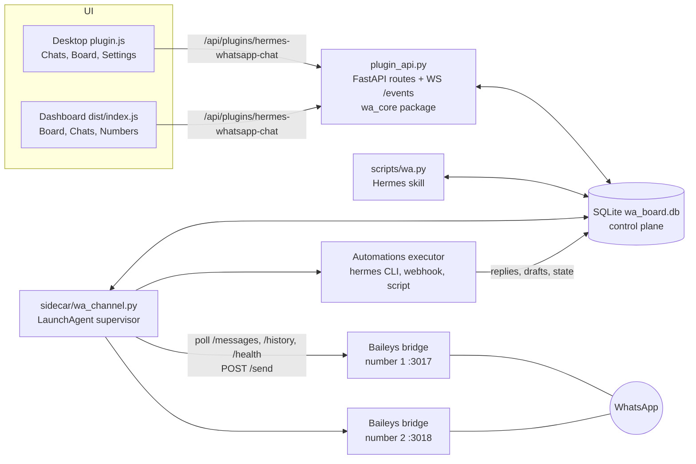

# hermes-whatsapp-chat

A [Hermes](https://hermes-agent.nousresearch.com) plugin that turns WhatsApp into a real chat inbox inside the Hermes desktop app and web dashboard, and lets Hermes agents work the inbox with you.

- **Multi-number chat.** Link several WhatsApp numbers by scanning a QR code from the plugin itself. Each number has its own session, label and color. Conversations are stored per number: the same contact on two numbers is two conversations.
- **Chats + Kanban board.** A full chat UI (thread, media, reply, drafts, search) and a board of conversation states: New, In progress, Waiting, Muted, Closed.
- **Independent WhatsApp channel.** A small background service (a macOS LaunchAgent) runs one vendored [Baileys](https://github.com/WhiskeySockets/Baileys) bridge per number. It has nothing to do with Hermes' native WhatsApp gateway, so you can keep a dedicated number (or several) for this inbox.
- **Automations / dispatcher.** Rules react to inbound or outbound messages and conversation events, and dispatch to a Hermes agent or profile, a webhook, a script, or a built-in action. Agent replies can be saved as drafts for you to approve, sent immediately, or kept only in the run log.
- **CLI + Hermes skill.** `scripts/wa.py` and the bundled `whatsapp-chat` skill let any Hermes agent list, read, draft, send, tag and re-state conversations. Everything shows up live in the UI.

The desktop app is the full experience. The web dashboard has the board, the chat (thread, reply, drafts) and number status/QR. Settings and automations are desktop only.

## Requirements

- macOS (the channel service is installed as a LaunchAgent).
- A working Hermes install (desktop app and/or dashboard). Node 22 comes with it (`~/.hermes/node/bin/node`); the sidecar needs Node 20 or newer.
- [uv](https://docs.astral.sh/uv/).
- Python 3.11 (uv installs it for the repo `.venv`; never install into the Hermes venv).

## Install

```bash
git clone https://github.com/singleflo/hermes-whatsapp-chat.git
cd hermes-whatsapp-chat

# 1. Python env (FastAPI, pydantic, segno for QR codes) and the vendored bridge's Node deps
uv sync --python 3.11
npm ci --prefix sidecar/whatsapp-bridge

# 2. Install the plugin: a REAL folder of symlinks under ~/.hermes/plugins/.
#    Never symlink the whole plugin dir: the desktop app lists ~/.hermes/plugins/ with
#    isDirectory() (false for symlinks) and would never copy the desktop half.
P=~/.hermes/plugins/hermes-whatsapp-chat; mkdir -p $P/desktop
ln -s "$PWD/plugin/plugin.yaml" $P/plugin.yaml; ln -s "$PWD/plugin/dashboard" $P/dashboard
ln -s "$PWD/plugin/desktop/plugin.js" $P/desktop/plugin.js
hermes plugins enable hermes-whatsapp-chat
```

3. Restart the Hermes app (the backend routes mount only at startup; `hermes gateway restart` also works).
4. Install and start the WhatsApp channel service:

   ```bash
   uv run python sidecar/wa_channel.py install
   ```

   If `node` is not on your `PATH`, point it at Hermes' Node: `WA_NODE=~/.hermes/node/bin/node uv run python sidecar/wa_channel.py install`.
5. Open **Conversations** in the Hermes desktop app (or the **Conversations** tab of the dashboard), go to **Settings → Numbers** (desktop) or the **Numbers** tab (dashboard), add a number and scan the QR code: WhatsApp on your phone → Settings → Linked devices → Link a device.
6. Optional: give Hermes agents the CLI skill:

   ```bash
   uv run python sidecar/wa_channel.py install-skill
   ```

Check everything with `uv run python sidecar/wa_channel.py status` (service, accounts, state per number).

## Using it

The desktop page has three sections: **Chats**, **Board**, **Settings**.

### Chats

A conversation list (all numbers, filterable by number, state and unread; messages can be searched across all of them) next to the thread. You can reply with text or a file, take over from the agent or hand back, escalate, mute, tag, move to another state and read the audit trail of state changes. Agent drafts appear in the thread with a Draft marker: approve (optionally edit first) or discard. Messages are labeled with who wrote them: contact, you (board), the linked phone, an agent profile, a rule, or the CLI. Live updates arrive over a WebSocket, with a polling fallback.

### Board

Five columns, one card per conversation: New, In progress, Waiting, Muted, Closed (hidden until you ask for it). Cards show the contact, number, preview, age, unread count, tags, urgency and drafts. Drag a card to move it; dropping on Muted snoozes it for the configured number of hours.

### Settings

- **Numbers**: add, rename, recolor, start/stop/restart, log out, remove (with or without deleting its conversations), choose the history import mode (`off`, `recent`, `full`) and an optional Hermes profile per number. Shows the background service status and QR pairing.
- **Conversation rules** (defaults in parentheses):
  - contact writes to a closed conversation: reopen as New, go back to the previous state, or keep closed (reopen as New);
  - contact replies while Waiting: move to In progress or keep (In progress);
  - contact writes to a muted conversation: reopen as New or keep (reopen as New);
  - your reply on a New / In progress conversation: move to Waiting or keep (Waiting);
  - auto-reply window: a message typed on the linked phone within N seconds of an inbound message is treated as a WhatsApp Business away/greeting auto-reply and changes nothing (10 s);
  - auto-close Waiting conversations after N days (7).
- **Notifications**: native notifications for new conversations, every inbound message, escalations; quiet hours.
- **Board**: urgency threshold, mute presets, drop-to-mute duration, closed-column limit.
- **Hours**: timezone and weekly business hours (used by automation conditions).
- **Automations**: the dispatcher described below, with a test button (dry run on a conversation) and a run log with retry.

Conversations created by history import start Closed, and history messages never trigger rules, unread counters, notifications or automations.

### Automations

An automation rule has an optional number filter, event types, conditions, an action, a reply mode and a "stop after match" flag. Rules run in order.

- **Events**: `message.in`, `message.out`, `conversation.created`, `conversation.state_changed`.
- **Conditions** (all optional, all must hold): conversation states, agent active or not, inside/outside business hours, text contains any of / matches a regex, any of the tags, first message of the conversation, message direction.
- **Actions**:
  | Type | What it does |
  |---|---|
  | `hermes` | Runs `hermes [-p PROFILE] chat -Q -q <prompt> --source whatsapp-chat [-s skill ...]`. Stdout is the reply. The profile defaults to the number's Hermes profile. |
  | `webhook` | POSTs `{event, conversation, messages}` as JSON, signed with `X-WA-Signature: sha256=<hmac>` when a secret is set. A JSON response may contain `reply`, `state`, `tags`, `escalate`. |
  | `script` | Runs a command with the same JSON on stdin; stdout JSON uses the webhook response shape. |
  | `reply` | Sends/drafts a fixed text template. |
  | `set_state` | Moves the conversation to a state. |
  | `add_tags` | Adds tags. |
  | `escalate` | Raises priority. |
  | `takeover` | Hands the conversation to a human (agent stops answering). |
- **Prompt templates**: `{contact_name} {phone} {text} {account_label} {state} {conversation_id} {history} {wa_cli}`.
- **Reply mode** (what happens with a reply text): `draft` (default, saved as a draft authored `agent:<profile>` or `rule:<id>` for you to approve), `send` (sent immediately), `none` (kept only in the run output).

Safety nets: runs are skipped when a human took over (`agent_active` off), automations never trigger on messages written by agents or rules (no loops), there is a per-conversation hourly rate limit, and failed runs retry up to 3 attempts with backoff (30 s, then 120 s).

## CLI for Hermes (and you)

```bash
.venv/bin/python scripts/wa.py list [--state S] [--account ID] [--unread] [--json]
.venv/bin/python scripts/wa.py show ID [--limit N] [--json]
.venv/bin/python scripts/wa.py draft ID TEXT          # for a human to review (preferred)
.venv/bin/python scripts/wa.py send ID TEXT           # real WhatsApp message
.venv/bin/python scripts/wa.py state ID STATE [--reason R]
.venv/bin/python scripts/wa.py tag ID +vip -spam
.venv/bin/python scripts/wa.py takeover ID            # also: handback ID
.venv/bin/python scripts/wa.py search QUERY [--account ID]
```

`ID` is the conversation id. The author of CLI messages is `agent:$HERMES_PROFILE` when that variable is set, otherwise `cli`. Exit code 0 is success, 1 an error (message on stderr). The bundled skill (`hermes-skill/whatsapp-chat/SKILL.md`) teaches agents these commands and the draft-first etiquette. Its command paths are absolute: edit the `WA=` line and the venv path if you cloned elsewhere.

Service management lives in `sidecar/wa_channel.py`: `install`, `uninstall`, `status`, `install-skill`, `run` (what launchd runs).

## Architecture



- **The database is the control plane.** The UI writes the desired state of each number (running, stopped, logged out, removed); the sidecar reconciles every second and writes status, QR codes and a heartbeat back. No extra port is opened for control.
- **Backend**: `plugin/dashboard/plugin_api.py` holds only HTTP routes and the live event stream; all logic is in the `plugin/dashboard/wa_core/` package (accounts, conversations, rules engine, outbound, automations, settings, schema/migrations).
- **Sidecar**: runs the supervisor loop, one bridge process per paired number (own session directory, port and media cache), the QR pairing subprocess, history ingest, timers (mute expiry, auto-close) and the automation executor on a small thread pool so message ingest never blocks.
- **Hermes interaction** uses only public surfaces: the plugin router, the two UI SDKs, the `hermes` CLI and HTTP.

### Data locations

| What | Where |
|---|---|
| Database | `~/.hermes/plugin-data/hermes-whatsapp-chat/wa_board.db` (override with `WA_ARCHIVE_DB`; base dir follows `HERMES_HOME`) |
| WhatsApp sessions | `<data>/sessions/<account id>/` |
| Received media | `<data>/wa-media/<account id>/` |
| Uploads (outgoing files) | `<data>/uploads/<account id>/` |
| Service log | `<data>/logs/channel.log` |
| LaunchAgent | `~/Library/LaunchAgents/it.fl1.hermes-whatsapp-chat.channel.plist` |
| Installed skill | `~/.hermes/skills/whatsapp-chat/` |

An existing v1 database (single number, `wa-session`) is migrated automatically on first start.

## Updating the vendored bridge

`sidecar/whatsapp-bridge/` is a copy of Hermes' bridge (`scripts/whatsapp-bridge` in `NousResearch/hermes-agent`) plus our own versioned patches in `sidecar/patches/` (currently `0001-history-sync.patch`, which adds history import and `GET /history`). To refresh it from a Hermes checkout:

```bash
sidecar/update_bridge.sh [HERMES_CHECKOUT]     # default ~/.hermes/hermes-agent
npm ci --prefix sidecar/whatsapp-bridge
uv run python sidecar/wa_channel.py install    # restarts the service
```

The script stages everything in a temp dir first: if a patch no longer applies it fails and leaves the vendored copy untouched. `sidecar/whatsapp-bridge/UPSTREAM` records the upstream commit and applied patches.

## Hermes updates

- The plugin and the channel service live in this repository and in `~/.hermes/plugin-data/`, outside Hermes' install tree, so `hermes update` does not touch them. The service runs from the repo `.venv` and the vendored bridge, not from the Hermes venv.
- The plugin only touches public Hermes surfaces (see above); the only internals it imports are guarded and fall back gracefully (`plugins.plugin_storage` for the data dir, the dashboard WebSocket auth check).
- After a Hermes update: restart the Hermes app, then check `uv run python sidecar/wa_channel.py status`. If the Hermes `hermes` binary moved and automations cannot find it, set `WA_HERMES_BIN`.
- Never edit the installed copy under `~/.hermes/desktop-plugins/`; `hermes plugins update` overwrites it. Edit this repo.

## Independence from Hermes' native WhatsApp

This plugin never reads or writes Hermes' own WhatsApp session, config or gateway. The channel service has its own sessions, ports (from 3017 up) and database. Use numbers here that Hermes' native WhatsApp gateway does not use.

## Uninstall

```bash
uv run python sidecar/wa_channel.py uninstall        # stop and remove the LaunchAgent
hermes plugins disable hermes-whatsapp-chat
rm -rf ~/.hermes/plugins/hermes-whatsapp-chat        # the symlink folder
rm -rf ~/.hermes/skills/whatsapp-chat                # if you installed the skill
```

Your data stays in `~/.hermes/plugin-data/hermes-whatsapp-chat/` until you delete it. Log the numbers out first (Settings → Numbers → Log out) to unlink the devices on WhatsApp's side.

## Development

```bash
uv run pytest -q                                        # tests/test_plugin_api.py, tests/test_automations.py
uv run ruff check . && uv run ty check plugin scripts sidecar tests
pnpm lint && pnpm format:check                          # JS halves (hand-written, no build step)
uv run python scripts/seed_demo.py --reset              # demo conversations (@demo.invalid; --remove to delete)
```

Conventions and architecture notes for contributors and agents are in [AGENTS.md](AGENTS.md).

The `docs/` folder is the original build kit used to create the plugin (Hermes plugin SDK notes, kanban case study, TDD notes). It is background reading: `docs/08-spec-wa-board.md` is superseded by this README and AGENTS.md.
